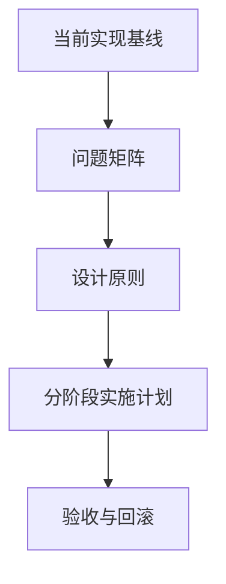

# 变更提案: cache_plan_doc_optimization

## 元信息
```yaml
类型: 优化
方案类型: implementation
优先级: P1
状态: 已确认
创建: 2026-03-06
```

---

## 1. 需求

### 背景
`docs/CACHE_REFACTOR_PLAN.md` 已有一版缓存系统重构草案，但当前内容仍偏“方向性描述”：

- 对现有实现的描述不够精确，部分内容与代码现状未完全对齐
- 各阶段缺少明确边界、交付物、验收口径和回滚策略
- 直接提出 `CacheManager`、WAL、主动治理等大项，但未给出风险拆分和先后顺序

本次任务不是直接改缓存实现，而是把该文档优化成后续开发可直接执行的设计输入。

### 目标
- 基于当前代码梳理缓存实现基线，区分“已具备能力”和“待建设能力”
- 重写文档结构，使阶段拆分、依赖关系、产出物和验收标准更清晰
- 调整技术路线，避免过早引入高风险架构改造，优先落地低风险增强项

### 约束条件
```yaml
时间约束: 本次仅优化方案文档，不改缓存运行时代码
性能约束: 文档建议不得破坏当前命中热路径设计
兼容性约束: 方案需保留现有 cache 插件配置与 API 兼容路径
业务约束: 方案必须以仓库当前代码行为为准，不凭空扩展现状能力
```

### 验收标准
- [ ] 文档准确描述当前缓存实现、配置方式、指标与 API 能力
- [ ] 文档给出分阶段实施路线，每阶段包含目标、改动点、交付物、风险与验收项
- [ ] 文档明确哪些内容属于近期落地、哪些内容推迟到后续阶段评估

---

## 2. 方案

### 技术方案
采用“基线校正 + 结构重写 + 路线收敛”的方式优化文档：

1. 先基于 `plugin/executable/cache/cache.go`、`pkg/cache/cache.go` 和 `config/sub_config/cache.yaml` 校正文档事实基线
2. 将文档改写为“现状 -> 问题矩阵 -> 设计原则 -> 分阶段路线 -> 验收与回滚”的结构
3. 将高风险项从“默认必须实现”调整为“满足前置条件后推进”，避免一开始就承诺全局 `CacheManager`

### 影响范围
```yaml
涉及模块:
  - docs/CACHE_REFACTOR_PLAN.md: 主文档重写与补强
  - plugin/executable/cache/cache.go: 用于校对现状与接口能力
  - pkg/cache/cache.go: 用于校对底层缓存行为与能力边界
  - config/sub_config/cache.yaml: 用于校对多实例配置现状
预计变更文件: 1
```

### 风险评估
| 风险 | 等级 | 应对 |
|------|------|------|
| 文档继续沿用不准确的现状描述，误导后续开发 | 高 | 逐项对照代码后再落文 |
| 过早承诺架构级改造，导致方案失真 | 中 | 将高风险能力后置，并写出前置条件 |
| 方案过于抽象，后续难拆任务 | 中 | 每阶段补充交付物、验证点和回滚策略 |

---

## 3. 技术设计（可选）

### 文档结构设计


---

## 4. 核心场景

### 场景: 为缓存重构开发提供可执行设计输入
**模块**: `docs/CACHE_REFACTOR_PLAN.md`
**条件**: 后续要推进缓存可靠性、可观测性或治理能力增强
**行为**: 开发者先依据文档确认现状、优先级、阶段目标与验收口径
**结果**: 设计评审和开发实施以同一套事实基线与任务拆解为准

---

## 5. 技术决策

### cache_plan_doc_optimization#D001: 先强化现有快照体系，再推进 WAL 与统一治理
**日期**: 2026-03-06
**状态**: ✅采纳
**背景**: 当前文档直接把 `CacheManager` 和 WAL 视为主路线，但现有实现仍以单插件实例、快照恢复和局部指标为主，立即推进全局治理改造风险偏高。
**选项分析**:
| 选项 | 优点 | 缺点 |
|------|------|------|
| A: 先做现有体系加固，再逐步升级恢复与治理能力 | 风险小，易验证，兼容当前配置与 API | 统一治理能力上线更晚 |
| B: 直接推进 WAL + CacheManager 一体化改造 | 长期形态更完整 | 改动面大，阶段边界不清，失败成本高 |
**决策**: 选择方案 A
**理由**: 当前最明确、最能立即带来收益的问题是 dump 原子性、恢复可观测性和指标缺口，应先把现有快照路径做稳，再决定是否需要全局统一管理器。
**影响**: 影响 `docs/CACHE_REFACTOR_PLAN.md` 中的阶段顺序、近期目标和风险评估表述
