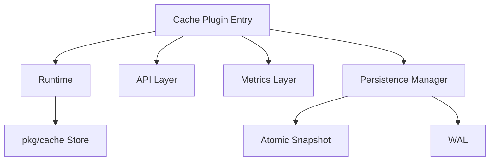

# 变更提案: cache_runtime_rebuild

## 元信息
```yaml
类型: 重构
方案类型: implementation
优先级: P0
状态: 已确认
创建: 2026-03-06
```

---

## 1. 需求

### 背景
当前缓存实现已经具备可用的 L1/L2 命中、lazy cache、dump/load 和基础 API，但存在以下生产级缺口：

- 持久化只有 snapshot，没有 WAL
- dump 写盘不是原子流程，异常退出可能损坏文件
- 运行时、持久化、指标、API 逻辑耦合在 `plugin/executable/cache/cache.go`
- 指标不足，无法量化 L1/L2、snapshot、WAL、lazy update 的行为
- 多实例仍是分散治理，但外部配置和 UI 已经深度依赖当前插件 tag 和 API 形态

用户要求这次直接完成生产级“一步到位”重构：不仅要改实现，还要覆盖兼容、测试、基准、文档和回滚路径。

### 目标
- 重构缓存插件为可维护的模块化实现
- 新增 snapshot + WAL 恢复链路，并保持旧配置兼容
- 补齐运行时指标和 `GET /stats`
- 保持现有 `/flush`、`/dump`、`/save`、`/load_dump`、`/show` 兼容
- 补核心测试、关键基准和文档

### 约束条件
```yaml
时间约束: 单轮内完成可提交的重构版本
性能约束: 不允许明显恶化缓存命中热路径
兼容性约束: 兼容现有 cache 插件配置和前端/API 入口
业务约束: 改动必须以现有代码行为为准，不引入无法验证的全局管理器
```

### 验收标准
- [ ] 现有 cache 配置可以继续工作，旧 API 兼容
- [ ] 新增 snapshot + WAL 恢复、/stats 和补充指标
- [ ] `go test` 覆盖缓存相关包通过，并新增基准可执行

---

## 2. 方案

### 技术方案
采用“插件内纵向重构 + 通用层最小增强”的方案：

- 在 `plugin/executable/cache/` 内拆分 runtime、persistence、WAL、metrics、API、codec 等子文件
- 保留插件入口、配置和对外 API 形态
- 新增 WAL 持久化控制器和恢复状态
- `pkg/cache` 仅做必要的通用增强，避免把 DNS 语义下沉到公共包
- 补文档、API 说明、测试和 benchmark

### 影响范围
```yaml
涉及模块:
  - plugin/executable/cache: 主重构区域
  - pkg/cache: 通用缓存容器的必要增强
  - config/sub_config/cache.yaml: 新配置项兼容验证
  - docs/API_REFERENCE.md: API 文档同步
  - docs/CACHE_REFACTOR_PLAN.md: 方案与实现对齐
  - coremain/www / config/webinfo: 兼容性验证（必要时微调）
预计变更文件: 10+
```

### 风险评估
| 风险 | 等级 | 应对 |
|------|------|------|
| 重构面大，容易引入回归 | 高 | 先拆骨架，再迁移逻辑，最后跑缓存相关测试和基准 |
| WAL 引入额外 IO 和复杂度 | 中 | WAL 可配置关闭，批量刷盘，保留 snapshot-only 回退 |
| 外部接口被前端和配置依赖 | 高 | 保持旧 API 语义不变，新增接口只增不删 |

---

## 3. 技术设计（可选）

### 架构设计


### API设计
#### `GET /stats`
- **请求**: 无
- **响应**: 实例级缓存统计、L1/L2 状态、snapshot/WAL 状态、最近恢复信息

### 数据模型
| 字段 | 类型 | 说明 |
|------|------|------|
| wal_file | string | WAL 文件路径，可选 |
| wal_sync_interval | int | WAL 刷盘间隔，秒 |
| last_load_status | string | 最近一次恢复状态 |

---

## 4. 核心场景

### 场景: 重启恢复
**模块**: `plugin/executable/cache`
**条件**: cache 配置了 dump/WAL 文件，服务重启
**行为**: 先加载 snapshot，再回放 WAL
**结果**: 缓存状态尽可能恢复，失败时也能降级启动

### 场景: 热路径命中
**模块**: `plugin/executable/cache`
**条件**: 查询命中 L1 或 L2
**行为**: 返回缓存结果并更新命中指标
**结果**: 保持当前热路径性能，不因持久化重构明显变慢

### 场景: 运维排障
**模块**: `plugin/executable/cache`
**条件**: 管理员需要检查缓存状态
**行为**: 调用 `/stats`、`/show`、`/save`、`/flush`
**结果**: 可以明确判断缓存规模、恢复状态和持久化行为

---

## 5. 技术决策

### cache_runtime_rebuild#D001: 采用插件内纵向重构，而不是引入全局 CacheManager
**日期**: 2026-03-06
**状态**: ✅采纳
**背景**: 用户要求一步到位完成生产级重构，但当前配置和前端都以插件实例和 tag 为中心，直接引入全局管理器会扩大回归面。
**选项分析**:
| 选项 | 优点 | 缺点 |
|------|------|------|
| A: 插件内纵向重构（推荐） | 兼容性更好，能聚焦 runtime/persistence/API/metrics | 仍需维护实例级治理 |
| B: 引入全局 CacheManager | 长期架构更统一 | 当前回归风险最高，改动面过大 |
| C: 把持久化能力下沉到 `pkg/cache` | 复用潜力高 | 会把 DNS 语义污染通用层 |
**决策**: 选择方案 A
**理由**: 能在单轮内交付可验证的生产级重构版本，同时保留现有外部兼容面。
**影响**: 主要影响 `plugin/executable/cache` 目录结构、测试、文档和指标设计
