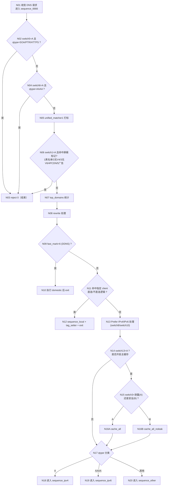
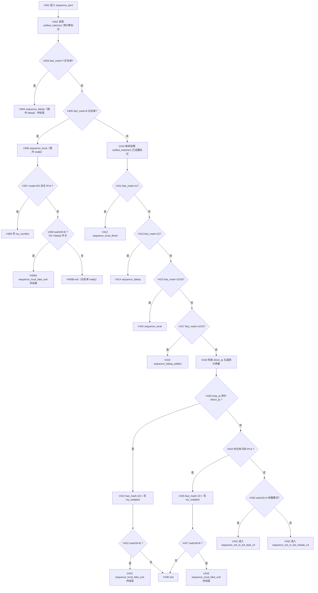
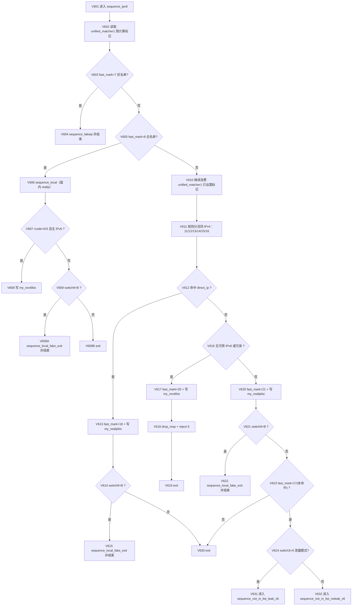
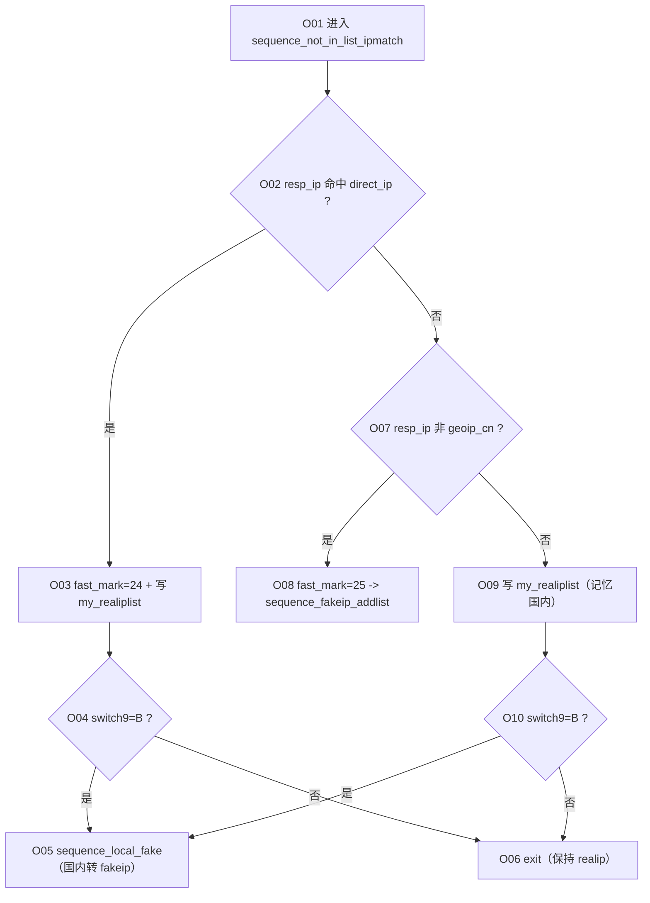
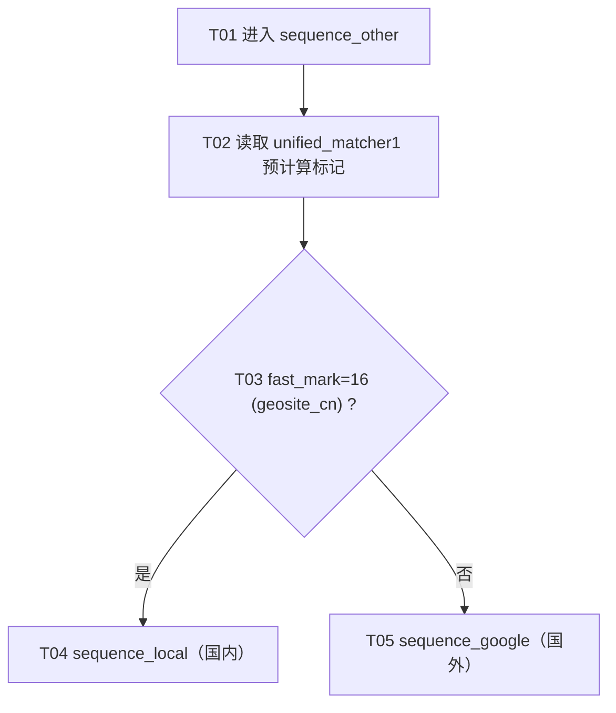

# MosDNS 解析流程（精细节点编号版）

> 依据当前项目配置整理：`config/config.yaml` + `config/sub_config/*.yaml`  
> 入口主序列：`sequence_6666`

## 1. 主流程（sequence_6666）

## 2. A 记录子流程（sequence_ipv4）

## 3. AAAA 子流程（sequence_ipv6）

## 4. 列表外域名 IP 对比核心（sequence_not_in_list_ipmatch）

## 5. 非 A/AAAA 流程（sequence_other）

## 6. 关键开关速查（来自 `switch*.txt`）

- `switch1`: 是否启用屏蔽类规则（黑名单/无解析等）
- `switch3`: 泄露模式(A) / 安全模式(B)
- `switch4`: 过期缓存总开关
- `switch5`: 阻止 SOA/PTR/HTTPS
- `switch6`: 阻止 AAAA
- `switch8`: Prefer IPv4
- `switch9`: CN 域名 realip/fakeip 切换
- `switch10`: Prefer IPv6
- `switch12`: 指定 client 不科学分支
- `switch13`: 主流程缓存开关
