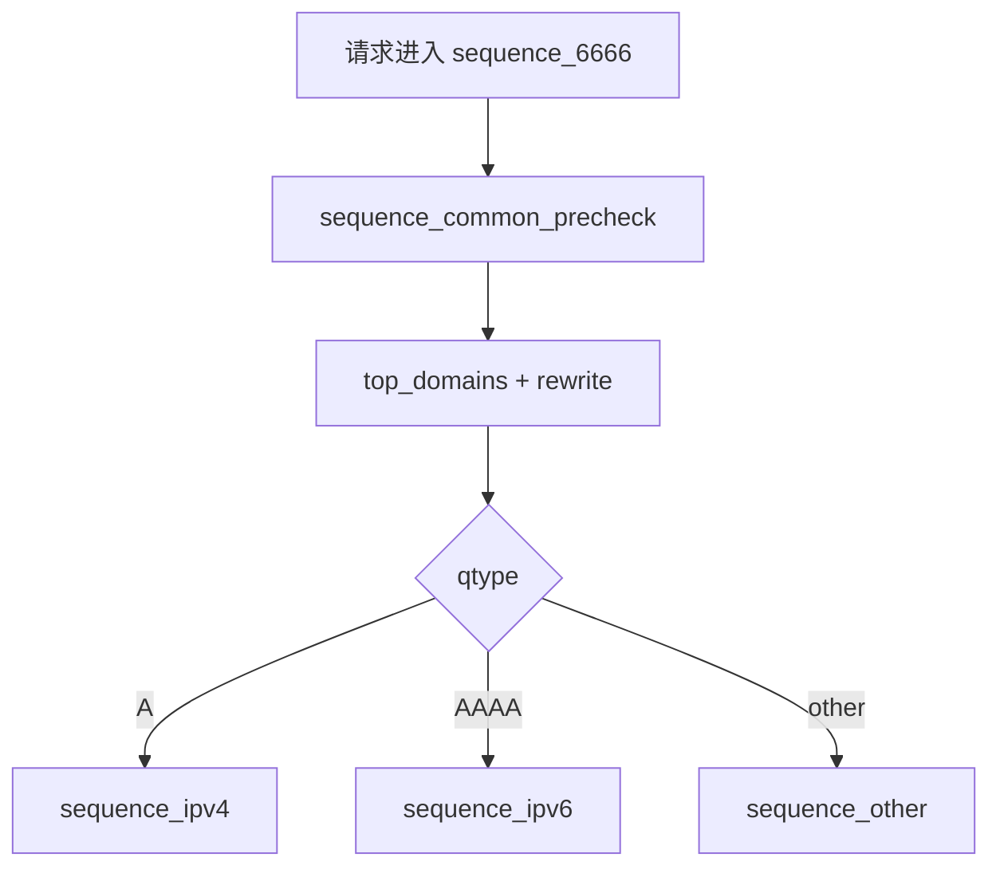
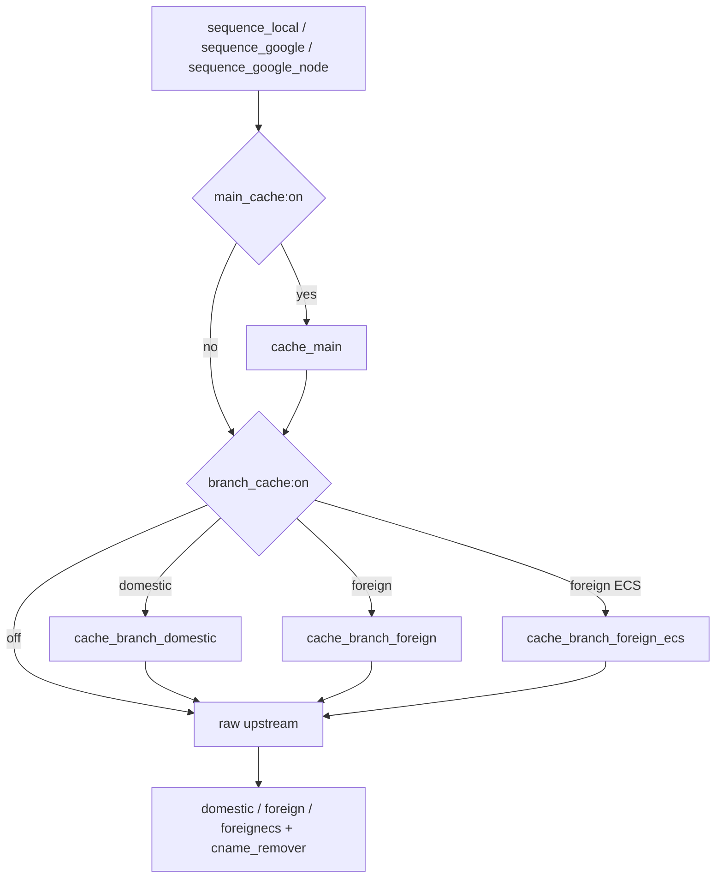
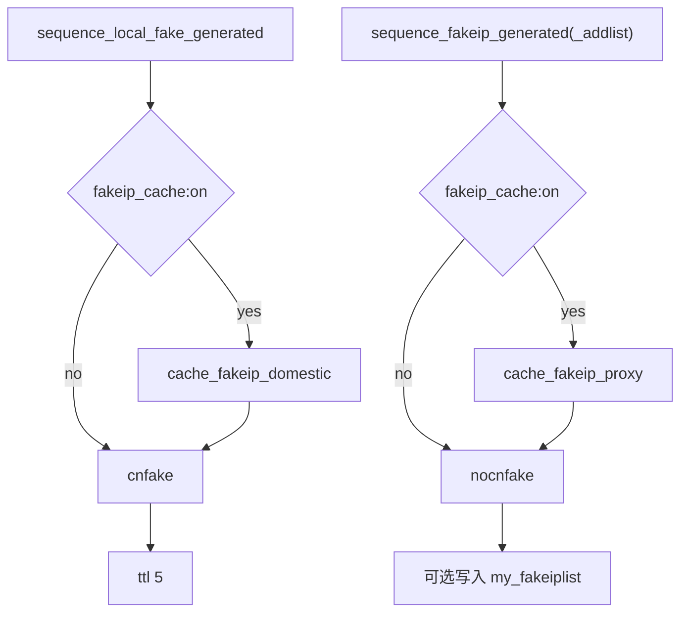
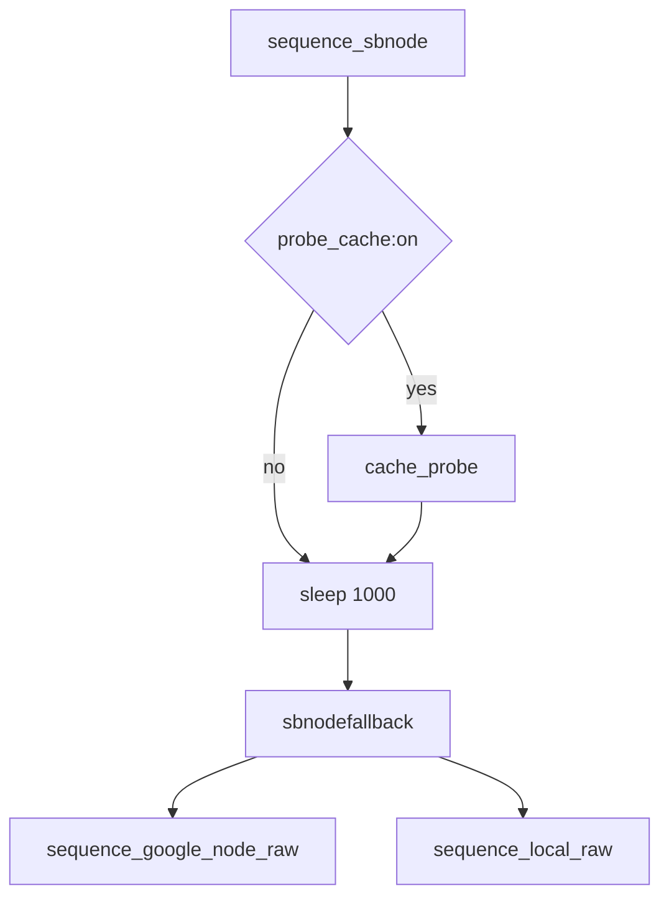

# MosDNS 解析流程（当前缓存架构版）

> 依据当前仓库：`config/config.yaml` + `config/sub_config/*.yaml`

## 1. 总体原则

- 入口层 `sequence_common_precheck` 只做前置检查，不再直接承担主缓存。
- `main_cache` 只下沉到真实解析链内部，因此不会再把 fakeip 应答混进主缓存。
- `branch_cache` 只覆盖真实解析分支缓存：
  - `cache_branch_domestic`
  - `cache_branch_foreign`
  - `cache_branch_foreign_ecs`
- `fakeip_cache` 只覆盖 fakeip 响应缓存：
  - `cache_fakeip_domestic`
  - `cache_fakeip_proxy`
- `probe_cache` 只覆盖 `sequence_sbnode` 的探测缓存：`cache_probe`
- `my_fakeiplist` 仍是记忆池，不属于响应缓存。

## 2. 主入口

## 3. 真实解析缓存链

## 4. FakeIP 缓存链

## 5. 节点探测链

## 6. 关键结论

- 关闭 `fakeip_cache` 后：
  - `cache_fakeip_domestic` 与 `cache_fakeip_proxy` 不再参与读写
  - `udp_fast_path` 也不会再复用 fakeip 结果
- 切换 `cn_answer_mode` 后，前端会主动清空核心响应缓存，降低旧 realip/fakeip 结果残留概率。
