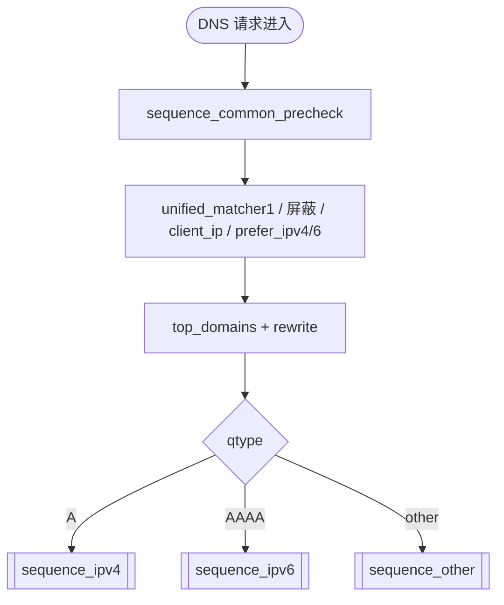
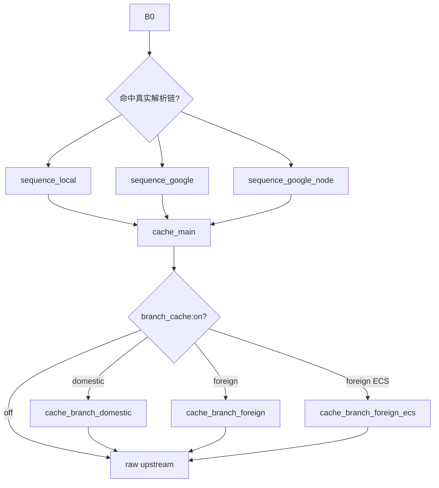
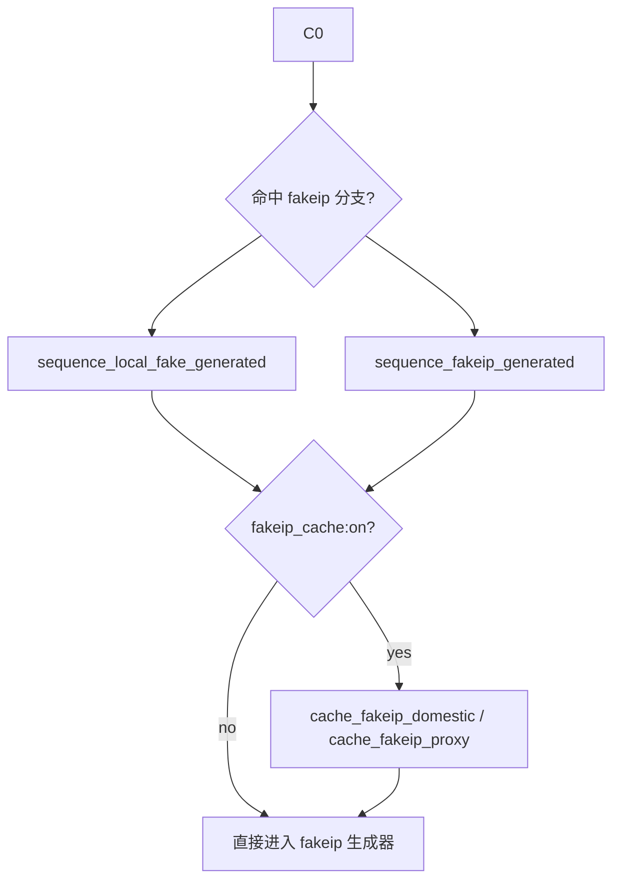
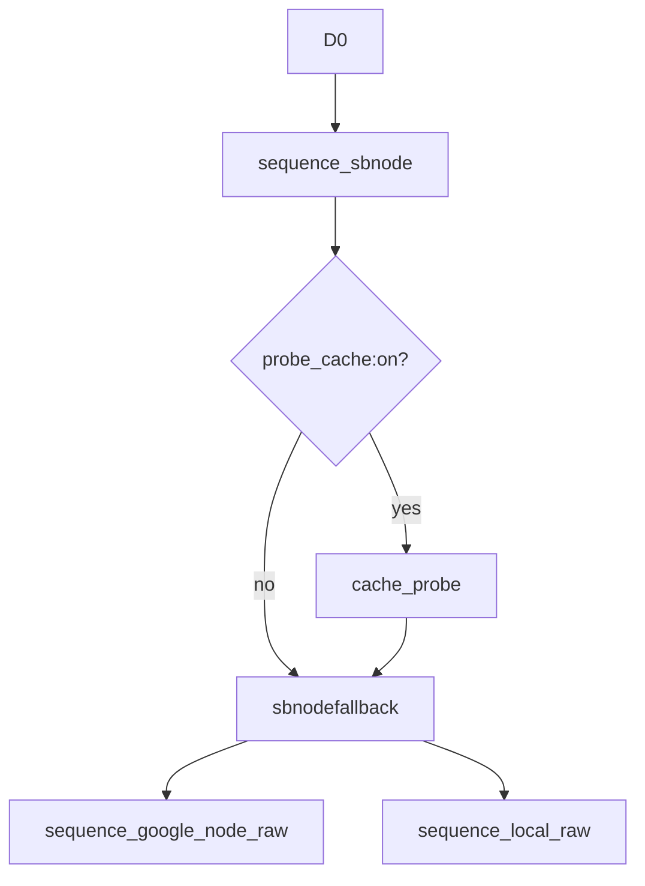

# MosDNS 解析流程（当前视觉顺序版）

## 主干

```mermaid
flowchart TB
    A0([DNS 请求进入]) --> A1[sequence_common_precheck]
    A1 --> A2[unified_matcher1 / 屏蔽 / client_ip / prefer_ipv4/6]
    A2 --> A3[top_domains + rewrite]
    A3 --> A4{qtype}
    A4 -- A --> B0[[sequence_ipv4]]
    A4 -- AAAA --> C0[[sequence_ipv6]]
    A4 -- other --> D0[[sequence_other]]
```

## 真实解析分支

```mermaid
flowchart TB
    B0 --> B1{命中真实解析链?}
    B1 --> B2[sequence_local]
    B1 --> B3[sequence_google]
    B1 --> B4[sequence_google_node]
    B2 --> B5[cache_main]
    B3 --> B5
    B4 --> B5
    B5 --> B6{branch_cache:on?}
    B6 -- domestic --> B7[cache_branch_domestic]
    B6 -- foreign --> B8[cache_branch_foreign]
    B6 -- foreign ECS --> B9[cache_branch_foreign_ecs]
    B6 -- off --> B10[raw upstream]
    B7 --> B10
    B8 --> B10
    B9 --> B10
```

## FakeIP 分支

```mermaid
flowchart TB
    C0 --> C1{命中 fakeip 分支?}
    C1 --> C2[sequence_local_fake_generated]
    C1 --> C3[sequence_fakeip_generated]
    C2 --> C4{fakeip_cache:on?}
    C3 --> C4
    C4 -- yes --> C5[cache_fakeip_domestic / cache_fakeip_proxy]
    C4 -- no --> C6[直接进入 fakeip 生成器]
    C5 --> C6
```

## 节点探测分支

```mermaid
flowchart TB
    D0 --> D1[sequence_sbnode]
    D1 --> D2{probe_cache:on?}
    D2 -- yes --> D3[cache_probe]
    D2 -- no --> D4[sbnodefallback]
    D3 --> D4
    D4 --> D5[sequence_google_node_raw]
    D4 --> D6[sequence_local_raw]
```
