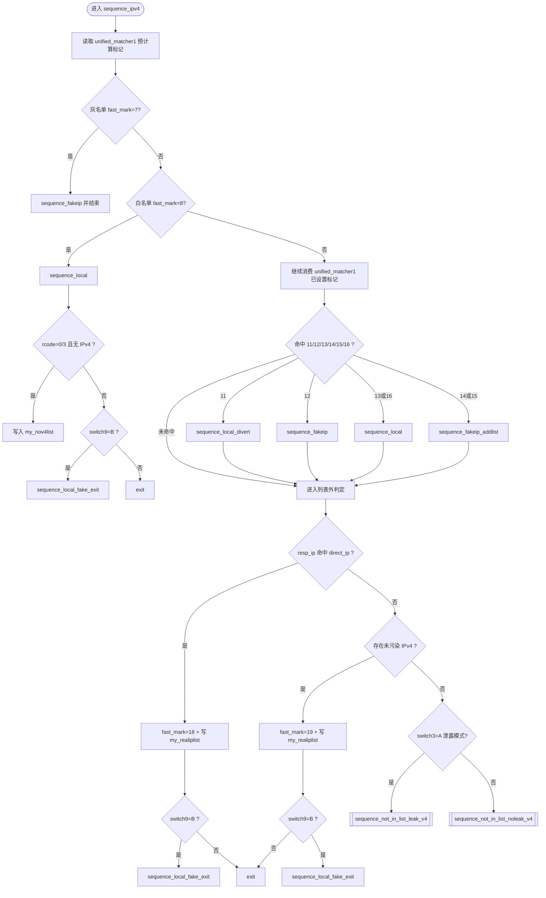
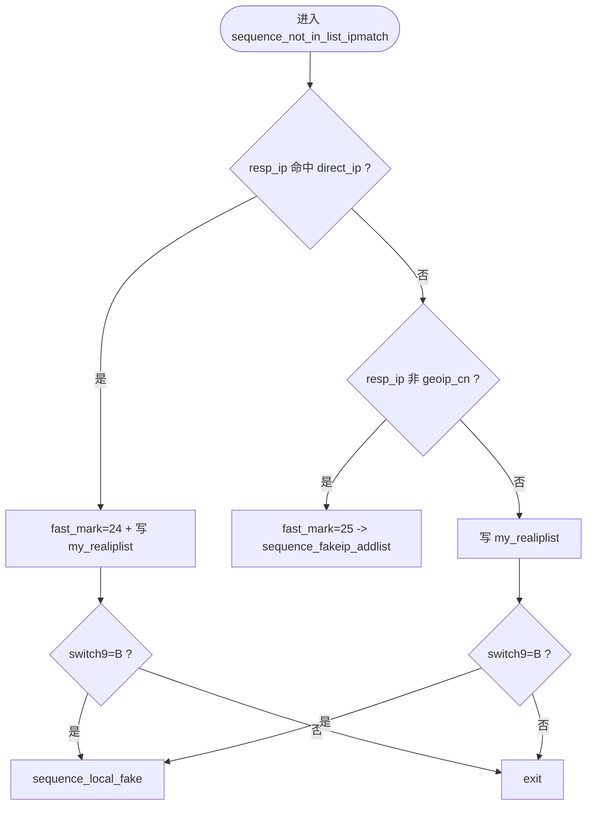

# MosDNS 解析流程（图同序版）

> 目标：尽量贴近你提供的流程图阅读顺序（自上而下主干 + 关键分叉）  
> 入口：`sequence_6666`  
> 依据：当前项目配置 `config/config.yaml` + `config/sub_config/*.yaml`

## 总览（主干同序）

```mermaid
flowchart TB
    A0([DNS 请求进入]) --> A1{qtype=SOA/PTR/HTTPS<br/>且 switch5=A ?}
    A1 -- 是 --> A2[reject 0]
    A1 -- 否 --> A3{qtype=AAAA<br/>且 switch6=A ?}
    A3 -- 是 --> A2
    A3 -- 否 --> A4[统一匹配 unified_matcher1]

    A4 --> A5{命中屏蔽类标记?<br/>1/2/3/4/5}
    A5 -- 是 --> A2
    A5 -- 否 --> A6[top_domains 统计]
    A6 --> A7[rewrite 重写]

    A7 --> A8{DDNS (fast_mark=6)?}
    A8 -- 是 --> A9[domestic 查询并 exit]
    A8 -- 否 --> A10{命中指定客户端分流?}
    A10 -- 是 --> A11[sequence_local + tag_setter + exit]
    A10 -- 否 --> A12[Prefer IPv4/IPv6 处理]

    A12 --> A13{缓存开关 switch13=A ?}
    A13 -- 是 --> A14{模式开关 switch3<br/>A=泄露 B=安全}
    A14 -- A --> A15[cache_all]
    A14 -- B --> A16[cache_all_noleak]
    A13 -- 否 --> A17[跳过主缓存]
    A15 --> A18{按 qtype 进入子流程}
    A16 --> A18
    A17 --> A18

    A18 -- A --> B0[[sequence_ipv4]]
    A18 -- AAAA --> C0[[sequence_ipv6]]
    A18 -- 其它 --> D0[[sequence_other]]
```

## A 流程（sequence_ipv4，同序）



## AAAA 流程（sequence_ipv6，同序）

```mermaid
flowchart TB
    C0([进入 sequence_ipv6]) --> C1[读取 unified_matcher1 预计算标记]
    C1 --> C2{灰名单 fast_mark=7?}
    C2 -- 是 --> C3[sequence_fakeip 并结束]
    C2 -- 否 --> C4{白名单 fast_mark=8?}
    C4 -- 是 --> C5[sequence_local]
    C4 -- 否 --> C9[继续消费 unified_matcher1 已设置标记]

    C5 --> C6{rcode=0/3 且无 IPv6 ?}
    C6 -- 是 --> C7[写入 my_nov6list]
    C6 -- 否 --> C8{switch9=B ?}
    C8 -- 是 --> C8A[sequence_local_fake_exit]
    C8 -- 否 --> C8B[exit]

    C9 --> C10[规则分流同 IPv4 的 11/12/13/14/15/16]
    C10 --> C11{resp_ip 命中 direct_ip ?}
    C11 -- 是 --> C12[fast_mark=18 + 写 my_realiplist]
    C11 -- 否 --> C15{无可用 IPv6 或污染?}

    C12 --> C13{switch9=B ?}
    C13 -- 是 --> C14[sequence_local_fake_exit]
    C13 -- 否 --> CEND[exit]

    C15 -- 是 --> C16[fast_mark=20 + 写 my_nov6list]
    C15 -- 否 --> C19[fast_mark=21 + 写 my_realiplist]
    C16 --> C17[drop_resp + reject 0]
    C17 --> C18[exit]

    C19 --> C20{switch9=B ?}
    C20 -- 是 --> C21[sequence_local_fake_exit]
    C20 -- 否 --> C22{fast_mark=17(未命中)?}
    C22 -- 否 --> CEND
    C22 -- 是 --> C23{switch3=A 泄露模式?}
    C23 -- 是 --> C24[[sequence_not_in_list_leak_v6]]
    C23 -- 否 --> C25[[sequence_not_in_list_noleak_v6]]
```

## 列表外 IP 对比（sequence_not_in_list_ipmatch，同序）



## 非 A/AAAA（sequence_other）

```mermaid
flowchart TB
    D0([进入 sequence_other]) --> D1[读取 unified_matcher1 预计算标记]
    D1 --> D2{fast_mark=16 (geosite_cn) ?}
    D2 -- 是 --> D3[sequence_local]
    D2 -- 否 --> D4[sequence_google]
```
